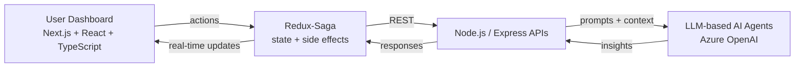

<!-- Save this as README.md in your repo: github.com/dubeyrishabh874/dubeyrishabh874 -->

---

## 👋 About Me

I'm a **Senior Software Engineer at Schindler** (Hyderabad, India) with **6 years** of experience building scalable web applications for enterprise, government, and client-facing platforms.

Right now I work at the intersection of **frontend engineering and AI**: designing the UI layer where LLM-based agents meet real users, so that AI output becomes something people can actually act on.

- 🤖 Led frontend integration of **70+ AI agents** into production enterprise workflows
- 📉 AI-powered predictive maintenance reporting contributed to a **20% reduction in repeat service calls**
- 🏛️ Previously built statewide **law-enforcement case-management dashboards** (CCTNS V2, Telangana Police)
- 🧑‍🏫 I mentor junior developers, run code reviews, and join architecture discussions
- 🏆 Team of the Year 2025 (Schindler Global SIS GAS) · Star Performer 2024 (Schindler AI)

## 🔭 What I'm Exploring

- Agent-to-UI patterns: **Web MCP**, **A2UI**-style interfaces, streaming agent responses
- **RAG** and LLM integration with **Azure OpenAI**
- **Micro Frontend** architecture at scale
- Performance, accessibility, and SEO with **Next.js (SSR / SSG / ISR)**

## 💬 Ask Me About

| Topic | What I can talk about |
|---|---|
| 🤖 AI in the frontend | Wiring LLM agents into real-time UIs, managing agent context and responses |
| 🧩 Micro Frontends | Component-driven architecture, shared design systems, team boundaries |
| ⚡ Next.js | Choosing between SSR, SSG, and ISR, SEO and rendering performance |
| 🧪 Frontend testing | Jest, React Testing Library, Cypress strategies that don't slow teams down |
| 🏛️ Government-scale apps | Role-based dashboards, security and confidentiality in regulated systems |

## 🛠️ Tech Stack

**Frontend**

 

**Backend & APIs**

**AI Integration**

**Testing, Cloud & DevOps**

## 🧱 How I Build AI-Powered Frontends

A simplified view of the pattern behind my current work (illustrative, no proprietary details):

## 🚀 Featured Work

### 🛗 Schindler AI · *2024 – Present*
AI-driven **predictive maintenance** for elevator systems.
- Integrated **70+ AI agents** into frontend workflows
- Role-based dashboards for equipment health, repair durations, and repair trends
- Real-time data visualization turning AI reports into faster decisions
- **Result:** ~20% fewer repeat service calls
- **Stack:** Next.js · React · TypeScript · Ant Design · Redux-Saga · Node.js · Azure · GitLab CI/CD · Docker

### 🚔 CCTNS V2, Telangana Police · *2021 – 2024*
Statewide crime and criminal tracking platform used by investigation teams.
- Built FIR Creation & Transfer, Petition Management, Investigation Tracking, Charge Sheet Filing, and reporting modules
- Role-based dashboards with strict data-confidentiality compliance
- Recognized with a **Commendation for Excellence from ADGP Telangana**

> 🔒 These are enterprise/government projects, so source code is private. Happy to discuss the architecture and lessons learned.

## 📦 Open Source & Side Projects

| Project | Description |
|---|---|
| [Web-Project](https://github.com/dubeyrishabh874/Web-Project) | User Admin Portal (JavaScript) |
| [Action-Board-Framework](https://github.com/dubeyrishabh874/Action-Board-Framework) | TypeScript project |
| [Ram-Portfolio](https://github.com/dubeyrishabh874/Ram-Portfolio) | Personal portfolio (TypeScript) |

## 📊 GitHub Stats

## 🎖️ Recognition

- 🏆 **Team of the Year (2025)**, Schindler Global SIS GAS Team
- ⭐ **Star Performer Award (2024)**, Schindler AI
- 🥇 **Commendation for Excellence**, ADGP Telangana (CCTNS V2)
- 🌟 **Employee of the Month**, Innoright Solution

## 🤝 Let's Connect

I enjoy conversations about **AI in the frontend, Micro Frontends, Next.js, and building products that scale**. If you're working on something similar, or just want to compare notes, reach out on [LinkedIn](https://www.linkedin.com/in/rishabh-dubeyy/) or [email me](mailto:dubeyrishabh874@gmail.com).

